# Tubra React

Frontend of Tubra. Tubra is a web-based application that serves as File system, Web-GIS and Executive Dashboard for management of Engineering and Operational practises of Aerodromes.

holds the backend for Tubra system, Tubra is a web-based GIS incorporated with an Executive Dashboard and file storage to manage Engineering Projects and Operational Activities in Aerodromes.
The system holds some capabilities as:

Map Rendering and simple Spatial Analysis Capabilities:  
The application provides a common set of spatial analysis tools  (Utilizing PostGIS and geos library); spatial relations as  (Touching, Crossing, Overlapping ...etc.), and spatial operations as (Linear measurements, Buffers, ..etc. ) can be applied by either using javascript mapping libraries in the front end or via connection to PostGIS and receiving analysis results. The following are some operations that can be made:

1.1 Map Display of Spatial Data:
Spatial Data (both GIS Data and geometric CAD Drawings) are georeferenced and viewed over the map, such a display can give a direct visual understanding of where aerodrome entities are placed, the following figure illustrate the map display:

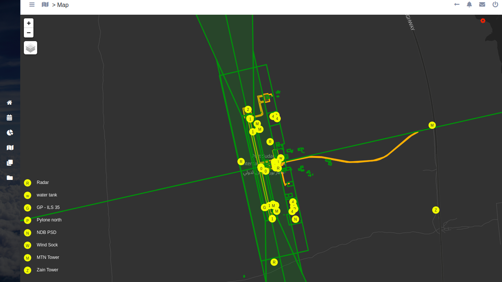

1.2 Aerodrome Entities Attribute Data Display:
Non-spatial Information (often written texts, docs, sheets and pdf files) about an Aerodrome entity are displayed via a modal, the user interact with the entity by clicking on the entity, in order for attribute data to be display, identify tool should be activated, the following figures illustrate the process of how attribute data is displayed:

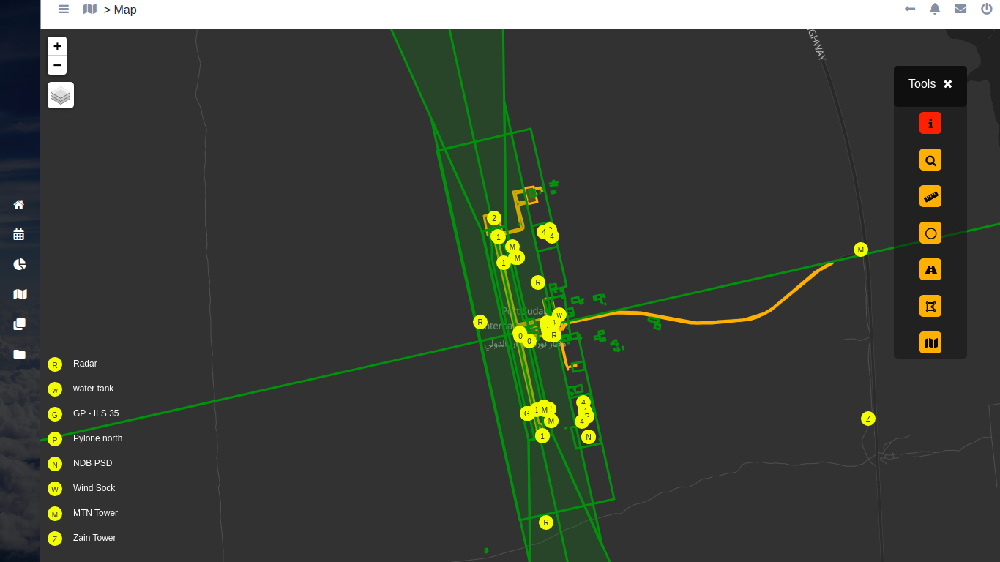
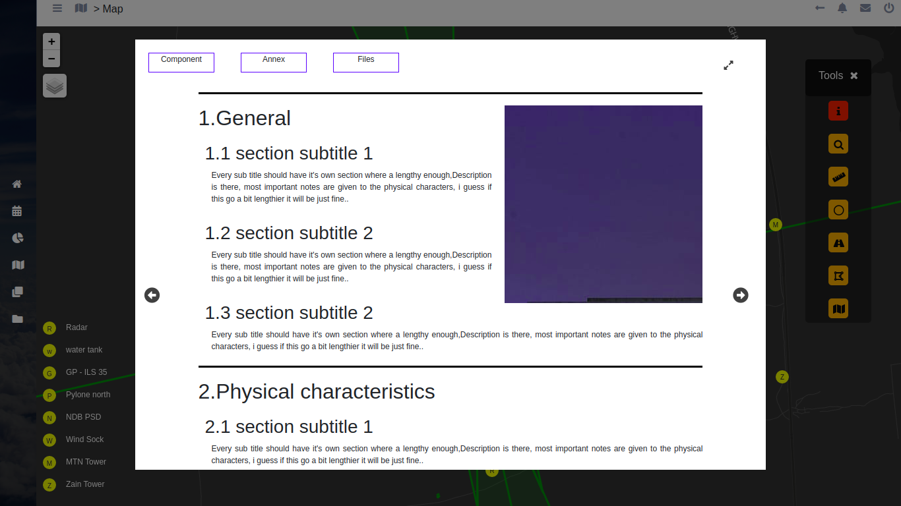
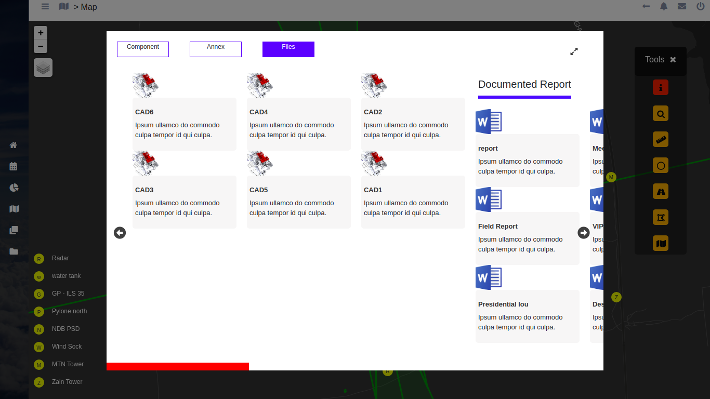
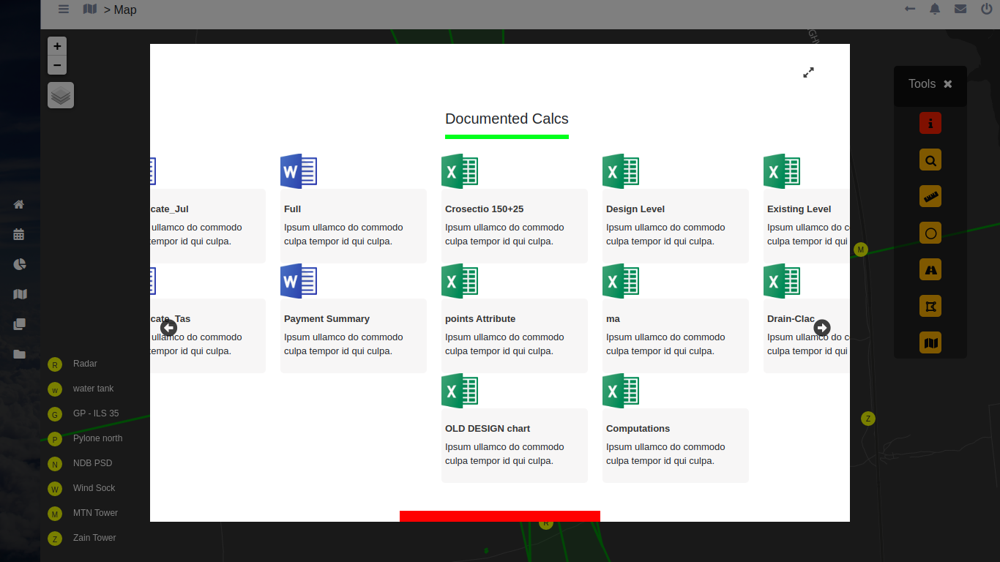

1.3 Search Capabilities with Autocompletion:
Aerodrome Entities can be searched via a search bar with autocompletion, as the user clicks on an entity the map zooms directly to that entity, the following figure illustrates Search bar component:

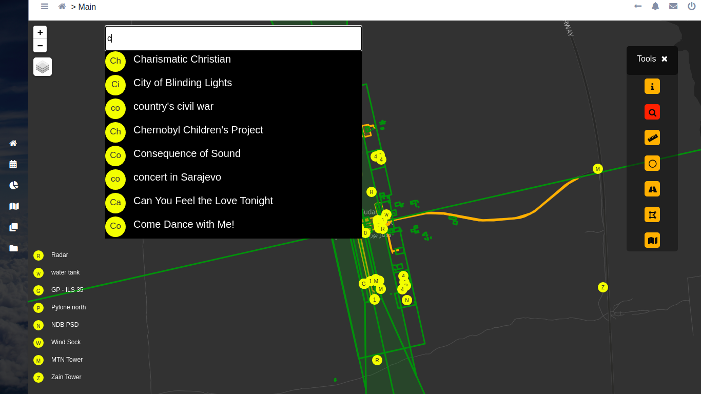

1.4 Linear Measurements:
Distances between Aerodrome entities can be calculated through a linear measurement component (a ruler gives the distances in meters), the resulting distance is illustrated in a simple input display and the line connecting two points is rendered over the map, the following figure illustrates the linear measurement capability:

 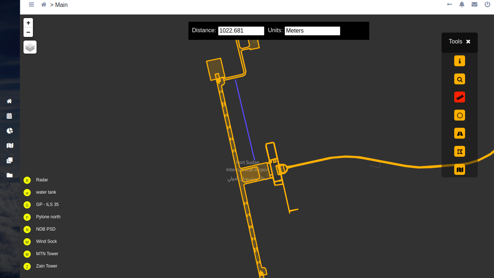

1.5 Buffer Analysis:
Three are three operations can be done with the buffer, a buffer can be added round an entity using a specific distance, this helps to visually identify what other entities intersect with the buffer distance, the buffer can also be removed from the map, and a buffer search is also provided where the entities inside the specified buffer distance are identified in the search component, the following figures illustrates adding a buffer to the map according to 200m distance from and entity:

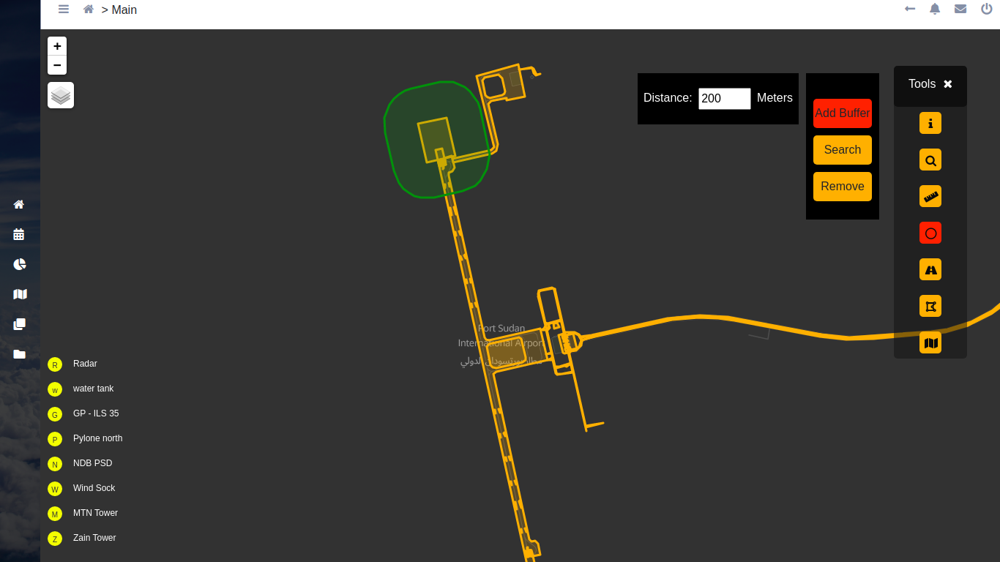

1.6 Vector Creation:
Points, Lines and Polygons can be created via the vector creation tool, the following figure illustrate the creation of a polygons:

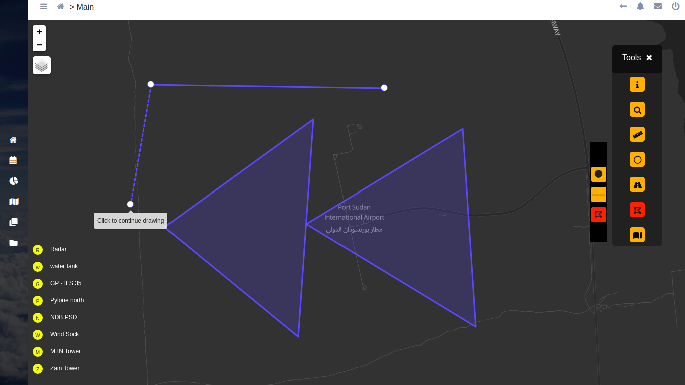

1.7 Tiles Basemap Switch:
The tile which serves as basemap (coming with leafletjs) can be changed, the following figure illustrates the tile changes

Figure 16

CAD (Computer aided Design) Viewer:
The system links the map to a CAD Viewer, it also provides a standalone component for viewing CAD files, CAD Drawing are stored in the database and served via an api, the following figures illustrates the CAD files and viewer:

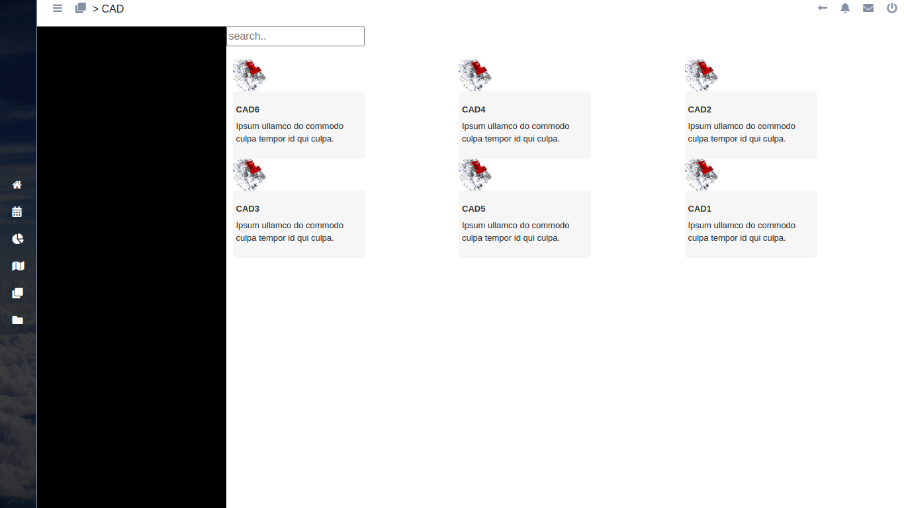

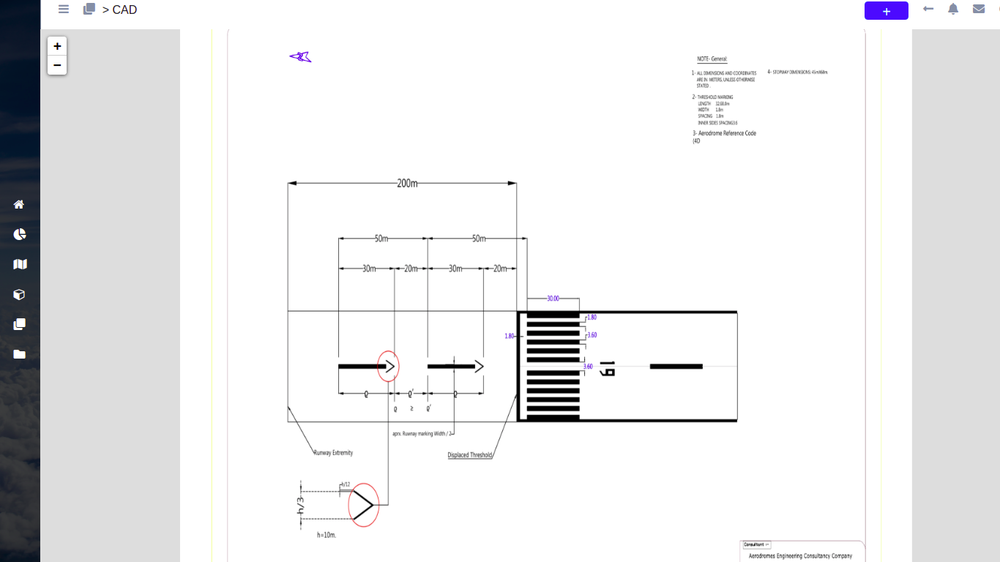

Also the Same CAD viewer can be viewed from the Map component as a linked attribute file as the user clicks on an entity.

Files (docs, sheets and pdf) Viewer:-
The system is capable of storing and viewing Ms docx,xlsx and pdf files, a standalone files component can be reached from the vertical navigation or as the user interacts with attribute data on the map with an aerodrome entity,  figures 2-4 illustrated files holder and files viewers (for the pdf format the default browser pdf reader is used).

Executive Dashboard Component:-
The Dashboard is meant to give a quick overview about a certain engineering project, charts, tables and diagrams to are use for information hold, the following figure illustrates the Dashboard:  
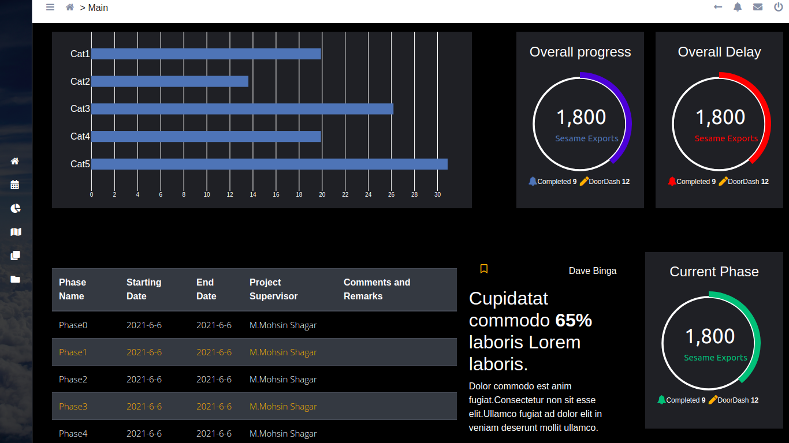
