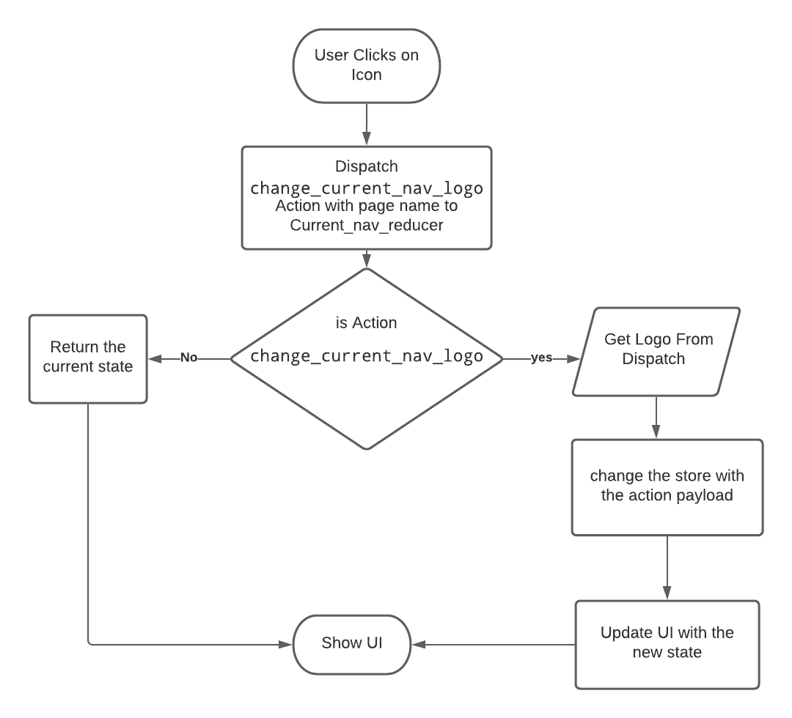

## Project Vertical Navigation Component \<VerticalNav/>

## General Overview

Project *\<VerticalNav/>* Component is responsible of Horizontal Navigation between different Elements,

### Component Type

functional component.

### Child Components

### Usage and Functionalities

1. Navigation between different components:
    this is the main functionality of the vertical navigation component as *\<VerticalNav>* handles what shows in the screen, React Router is used to complete this functionality. refer to <<<<<link to react router implementation goes here >>>>> 

2. Changing current horizontal navigation component name:
    this functionality is about changing the name that appears as the current page name on navigation (see figure x.x below)
    
    redux flow is used, change_current_nav_name action is triggered as the user clicks on vertical navigation icon, Current_page_name text which is stored in Current_nav_reducer is changed upon the action, scheme x.x below illustrates the redux flow to change the current page navigation name.
    
    
figure x.x nav name change scheme

3. Changing current horizontal navigation component logo:
    this functionality is about changing the logo that appears as the current page logo on navigation (see figure x.x below)
    
    also redux flow is used, change_current_nav_logo action is triggered as the user clicks on vertical navigation icon, Current_page_logo icon which is stored in Current_nav_reducer is changed upon the action, scheme x.x below illustrates the redux flow to change the current page navigation name.
    
    
figure x.x nav logo change scheme

### Functions implemented

1. handleClick:
    this function is called when the user clicks on the icon to change the component viewed on the screen, it passes two parameters to redux store (name,logo) so the name of the appearing component and it's logo change accordingly.

#### *Parameters*

name (String): name of the component to be viewed on the  screen. 
logo (String): class name of the icon used to the represent the logo of the component to be viewed in the screen.

### Implementation

1. JSX:

~~~jsx

import React from 'react'
import './styles/styles.css'
import {Link} from 'react-router-dom'
import {useState,useEffect} from 'react'
import {useSelector,useDispatch} from 'react-redux'
import change_current_nav_name from '../../Actions/NavActions/change_current_name'
import change_current_nav_logo from "../../Actions/NavActions/change_current_logo";

export default function Index(){
    const current_nav_name = useSelector(state=>state.Current_nav_reducer.current_name)
    const dispatch = useDispatch()
    
    const handleClick=(name,logo)=>{
        dispatch(change_current_nav_name(name))
        dispatch(change_current_nav_logo(logo))
    }
    
    return (
            

                    

                    

                    

                        <Link to='/' onClick={()=>handleClick('Main','fa fa-home')}><i className='fa fa-home'></i></Link>                               
                        <Link to='schedule' onClick={()=>handleClick('Schedule','fas fa-calendar-alt')}><i className='fas fa-calendar-alt'></i></Link>  
                        <Link to='/charts' onClick={()=>handleClick('Charts','fas fa-chart-pie')}><i className='fas fa-chart-pie'></i></Link>
                        <Link to='/map' onClick={()=>handleClick('Map','fas fa-map')}><i className='fas fa-map'></i></Link>
                        <Link to='/cad' onClick={()=>handleClick('CAD','fas fa-clone')}><i className='fas fa-clone'></i></Link>
                        <Link to='/files' onClick={()=>handleClick('Files','fas fa-folder')}><i className='fas fa-folder'></i></Link>
                        <i className=''></i>
                    

                
          
            

        )
    }
~~~

2. Styles (css):
~~~
.Project-page-vertical-nav{
    width:70px; 
    height:100%; 
    position: absolute;
    top:0px; 
    left:0px; 

}

.Project-page-vertical-nav-container{
    width:80%; 
    height: 100%;
    position: relative;
    display:flex;
    flex-direction: column; 
    align-items: center;
    justify-content: center;
    border-right:0.5px solid #8493a5; 
    background:url('../images/taylor-van-riper-yQorCngxzwI-unsplash.jpg');
    background-size: cover;
    background-position: center; 
}

.Project-page-vertical-nav-black-drop {
    position: absolute;
    top:0px; 
    left:0px; 
    width:100%; 
    height: 100%;
    background-color:rgba(0, 0, 0, 0.55);
    
}

.Project-page-vertical-nav-first-icons-set-container{
    display: flex;
    flex-direction: column;
}

.Project-page-vertical-nav-first-icons-set-container i{
    color:#fff;
    margin-top:20px; 
    z-index:2; 
    cursor:pointer; 
}

.Project-page-vertical-nav-first-icons-set-container a{
    color:white; 
    cursor: pointer;
    z-index:2; /* this is because if it didn't present the link won't work as the icon it wraps has z-index of 2*/
}
~~~
